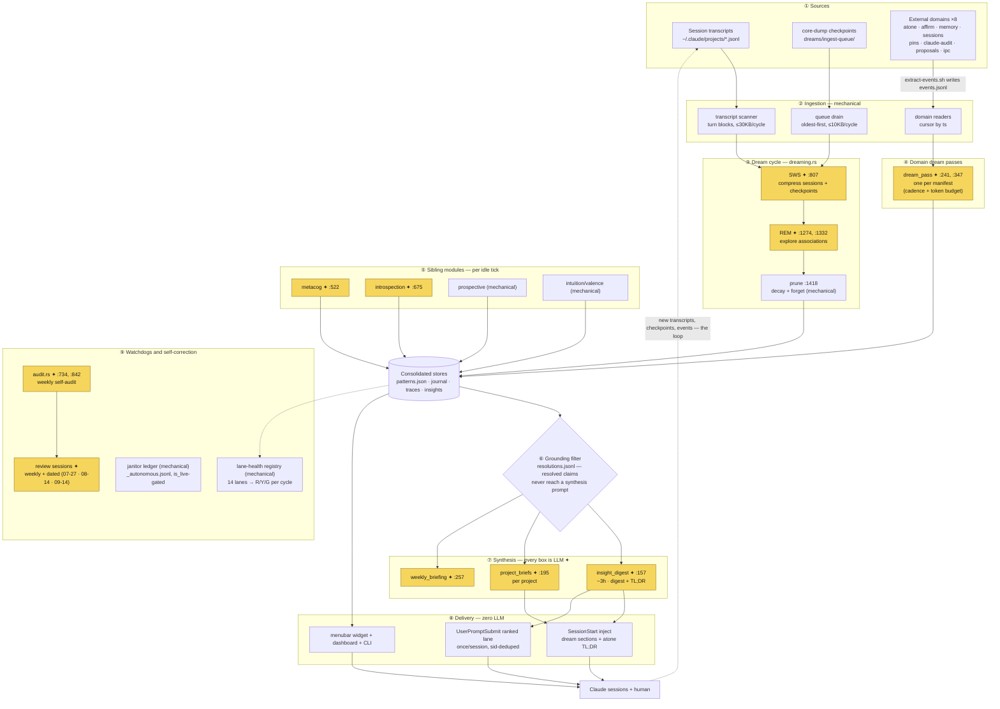

# i-dream — architecture and LLM touchpoints

How the system fits together, and exactly where a model is involved. Every LLM
call in the engine routes through one method, `ClaudeClient::analyze`
(api.rs:210), so the nine call sites listed at the bottom are the complete set.
Line references are as of commit `42eae64` (2026-07-17).

Legend: **✦ = LLM call site** · everything unmarked is mechanical code.

## Flow diagram (Mermaid)



## Terminal diagram (ASCII)

```
────────────────────────────── ① SOURCES ────────────────────────────────
┌────────────────────┐ ┌─────────────────────┐ ┌────────────────────────┐
│ SESSION TRANSCRIPTS│ │ /core-dump          │ │ EXTERNAL DOMAINS ×8    │
│ ~/.claude/projects/│ │ CHECKPOINTS         │ │ atone · affirm · memory│
│ <proj>/<sid>.jsonl │ │ dreams/ingest-queue/│ │ sessions · pins ·      │
│ (every session)    │ │ <ts>-<slug>.json    │ │ claude-audit ·         │
└─────────┬──────────┘ └──────────┬──────────┘ │ proposals · ipc        │
          │                       │            │                        │
          │                       │            │ extract-events.sh      │
          │                       │            │   └──► events.jsonl    │
          │                       │            └───────────┬────────────┘
          ▼                       ▼                        ▼
──────────────────── ② INGESTION (all mechanical) ───────────────────────
┌────────────────────┐ ┌─────────────────────┐ ┌────────────────────────┐
│ transcript scanner │ │ queue drain         │ │ domain readers         │
│ turn blocks,       │ │ oldest-first,       │ │ cursor by ts,          │
│ ≤30KB per cycle    │ │ ≤10KB per cycle,    │ │ run before each read   │
│                    │ │ archive-on-consume  │ │ ([consolidation])      │
└─────────┬──────────┘ └──────────┬──────────┘ └───────────┬────────────┘
          └───────────┬───────────┘                        │
                      ▼                                    ▼
─────────── ③ DREAM CYCLE (dreaming.rs) ────────  ④ DOMAIN DREAM PASSES ─
┌───────────────────────────────────────────┐  ┌────────────────────────┐
│ SWS  ✦ :807   compress sessions +         │  │ dream_pass.rs ✦        │
│  │            checkpoints into learnings  │  │ :241,347               │
│  ▼            → patterns.json · journal   │  │ one per domain         │
│ REM  ✦ :1274,1332  explore associations   │  │ manifest (cadence +    │
│  │            → association edges         │  │ token budget, e.g.     │
│  ▼                                        │  │ ipc: 3000 tok / 2d)    │
│ prune (mech, :1418)  decay + forget       │  │ → <dom>-insights.jsonl │
└─────────────────────┬─────────────────────┘  └───────────┬────────────┘
                      ▼                                    │
──────────────── ⑤ SIBLING MODULES (per idle tick) ─────── │ ────────────
┌───────────────────────────────────────────────────────┐  │
│ metacog ✦ :522 · introspection ✦ :675 · prospective   │  │
│ (mech) · intuition/valence (mech, ignores client)     │  │
└─────────────────────┬─────────────────────────────────┘  │
                      ▼                                    ▼
             ┌─────────────────────────────────────────────────┐
             │ CONSOLIDATED STORES                             │
             │ patterns.json · journal · traces · insights     │
             └───────────────────────┬─────────────────────────┘
                                     │
             ┌───────filter──────────▼─────────────────────────┐
             │ ⑥ GROUNDING  resolutions.jsonl (truth-decay:    │
             │ resolved claims never reach a synthesis prompt) │
             └───────────────────────┬─────────────────────────┘
                                     ▼
──────────────── ⑦ SYNTHESIS (every box here is LLM ✦) ──────────────────
┌────────────────────┐ ┌─────────────────────┐ ┌────────────────────────┐
│ insight_digest     │ │ project_briefs      │ │ weekly_briefing        │
│ ✦ :157 · ~3h       │ │ ✦ :195 · per proj   │ │ ✦ :257 · weekly        │
│ → insight-digest.md│ │ → project-briefs/   │ │ → briefing doc         │
│ → derived/_tldr.txt│ │   <proj>.md         │ │                        │
└─────────┬──────────┘ └──────────┬──────────┘ └───────────┬────────────┘
          └───────────────────────┼────────────────────────┘
                                  ▼
─────────────────── ⑧ DELIVERY (mechanical, zero LLM) ───────────────────
┌────────────────────┐ ┌─────────────────────┐ ┌────────────────────────┐
│ SessionStart hook  │ │ UserPromptSubmit    │ │ menubar widget +       │
│ dream sections +   │ │ ranked lane:        │ │ dashboard (Swift) ·    │
│ atone TL;DR into   │ │ once per session,   │ │ CLI verbs (status,     │
│ new sessions       │ │ sid-deduped         │ │ views, insight-digest) │
└─────────┬──────────┘ └──────────┬──────────┘ └───────────┬────────────┘
          └───────────────────────┼────────────────────────┘
                                  ▼
                ┌─────────────────────────────────────┐
                │  CLAUDE SESSIONS + HUMAN            │
                └──────────────────┬──────────────────┘
                                   │  new transcripts, checkpoints,
                                   │  ipc messages, atone/affirm events
                                   └────────────► back to ① (the loop)

──────────── ⑨ WATCHDOGS & SELF-CORRECTION (observe everything) ─────────
┌────────────────────────────────────────────────────────────────────────┐
│ lane-health registry (mech): 14 lanes → R/Y/G verdict every cycle      │
│ janitor ledger (mech): _autonomous.jsonl — is_live-gated, revertible   │
│ audit.rs ✦ :734,842 weekly self-audit → staged proposals ──►           │
│   interactive REVIEW SESSIONS ✦ (Sun/Mon crons + dated health          │
│   reviews 07-27 · 08-14 · 09-14) — full Claude sessions, outside       │
│   the engine                                                           │
└────────────────────────────────────────────────────────────────────────┘
```

## The nine LLM call sites

| # | Call site | What the model does | Budget |
|---|-----------|---------------------|--------|
| 1 | `dreaming.rs:807` | SWS: compress new transcripts + drained checkpoints into structured learnings | per-cycle |
| 2 | `dreaming.rs:1274`, `:1332` | REM: explore creative associations across patterns | per-cycle |
| 3 | `metacog.rs:522` | metacognition audit of agent behavior | per-cycle |
| 4 | `introspection.rs:675` | introspection pass | 4096 tok |
| 5 | `insight_digest.rs:157` | ~3h digest TL;DR + sentiment | 512 tok |
| 6 | `project_briefs.rs:195` | per-project briefs | 1024 tok |
| 7 | `weekly_briefing.rs:257` | weekly briefing | 4000 tok |
| 8 | `consolidation/dream_pass.rs:241`, `:347` | external-domain dream passes | per manifest |
| 9 | `audit.rs:734`, `:842` | weekly self-audit: analyst pass + render pass | audit budget |

## Deliberately LLM-free

- **intuition/valence** takes the client and ignores it (intuition.rs:549).
- **The dreaming prune phase** likewise (dreaming.rs:1418).
- **The entire delivery layer** — both injection hooks, the widget, the
  dashboard, the CLI — reads derived files only. That is why the per-prompt
  ranked lane can run as a synchronous UserPromptSubmit hook with no latency
  or token cost.
- **lane-health and the janitor** are pure bookkeeping.

## Runtime

One launchd daemon plus four cron LaunchAgents (`daily`, `dreampass`, `audit`,
`review`). All ✦ sites call `ClaudeClient::analyze` (api.rs:210), which by
default shells out to the local `claude` CLI on the subscription
(api.rs:171-199, `budget.use_claude_code_cli`); the direct Anthropic API is
the explicit fallback. Model: `budget.model` = `claude-sonnet-4-6`
(config.toml). `model_heavy` (`claude-opus-4-6`) is defined in config but no
engine call site currently uses it. The scheduled review sessions are full
interactive Claude sessions outside the engine, opened by gcc-schedule
one-shots.
