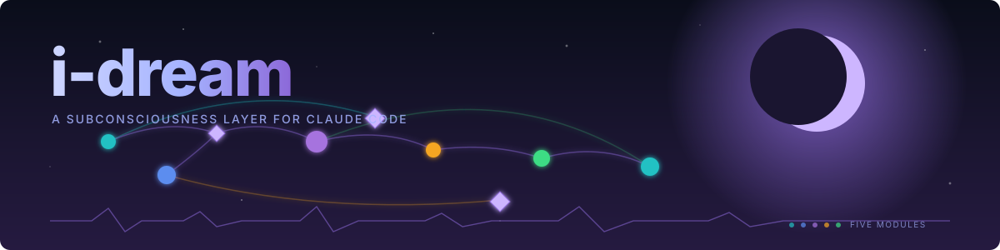

<div align="center">



**Background memory consolidation, pattern extraction, intuition, metacognition, and introspective self-analysis — running silently while you work.**

<details>
<summary><strong>📑 Table of contents</strong></summary>

- [Top highlight insights — and how they got there](#top-highlight-insights--and-how-they-got-there)
- [How it works](#how-it-works)
- [Consolidation pipeline](#consolidation-pipeline)
- [Quickstart](#quickstart)
- [CLI reference](#cli-reference)
- [macOS menu-bar widget](#macos-menu-bar-widget)
- [Comprehensive dashboard](#comprehensive-dashboard)
- [Configuration](#configuration)
- [Data directory](#data-directory)
- [Testing](#testing)
- [Project structure](#project-structure)
- [Research foundations](#research-foundations)
- [Documentation index](#documentation-index)
- [Contributing](#contributing)
- [License](#license)

</details>

[](LICENSE.md)
[](https://www.rust-lang.org/)
[](docs/09-cli-vs-api.md)
[](.github/workflows/ci.yml)
[](CHANGELOG.md)
[](docs/06-menubar-widget.md)

</div>

---

## Top highlight insights — and how they got there

These are real insights surfaced by i-dream from one developer's recent Claude Code sessions. Each one shows the **full journey** from raw input to surfaceable artifact — what the dreaming pipeline actually *does*.

### Insight 1 — "Treat /core-dump as a save-point primitive"

```
RAW INPUT (USER prompt, captured by D1):
  "I'm about to clear context — make a core-dump first so we don't
   lose the design we just nailed down."

  + 8 similar prompts across 4 projects, all involving /core-dump
  fired BEFORE risky ops, not just at session end.

           │
           ▼  SWS — pattern extraction
  Pattern  68% confident  ◆ actionable  user-preference
    "Core-dump has evolved from session-end ritual to mid-session
     checkpoint tool — proactive use is now the norm, not the
     exception."

           │
           ▼  REM — cross-pattern association
  Association  68% confident  ◆ actionable
    "/core-dump is now a 'save point' primitive, not a 'goodbye'
     primitive. The pattern of 20-80% mid-session usage indicates
     the user has trained the +17 more associated patterns."
    → Rule: Treat /core-dump as a save-point primitive: invoke
      proactively at milestones, before risky ops, and before long
      autonomous stretches — not only at session end.

           │
           ▼  Wake — promotion to insights.md
  Becomes a Context-trigger Intention with that rule.
  The next SessionStart hook surfaces it into Claude's context
  whenever the new session looks like a checkpoint candidate.

           │
           ▼  Where it lives globally (gcc = global Claude config)
  Promoted into ~/.claude/CLAUDE.md once it recurs in ≥3 projects
  (the project-transfer detector — D12, planned).
```

### Insight 2 — "Read before write — the failure mode is acting on stale state"

```
RAW INPUT:
  Repeated user corrections across projects:
    "no, re-read the file first"
    "you assumed the variable was still X but I renamed it"
    "check git status before opening that PR"

           ▼  Pattern (SWS)
  Pattern  93% confident  ◆ actionable  approach  negative
    "Acting on stale or assumed state is the primary failure mode,
     whether in UI coordinates, repository context, or file contents."

           ▼  Association (REM)
  Promoted insight: "Read before write" — the discipline that links
  the patterns of stale-state failure across all 5 i-dream projects.

           ▼  Where it lands
  ~/.claude/CLAUDE.md ← top-level rule (graduated via cross-project
                        recurrence)
  + Active intention: surfaces "verify state before any side-effect"
    whenever a session start looks like edit-heavy work.
```

### Insight 3 — "Match response length to user message length"

```
RAW INPUT:
  Dozens of single-word continuation prompts ("yes", "next",
  "keep going") followed by Claude responding with multi-paragraph
  summaries — followed by user corrections like "stop summarizing
  what you just did, I can read the diff."

           ▼  Pattern (SWS, both positive and negative)
  Pattern  72% confident  ◆ actionable  user-preference
    "The user's terse interaction style ('keep going', 'next', 'move')
     and the fire-and-forget notification pattern share a common
     communication philosophy: minimal-signal, maximum-context-inference."

           ▼  Association (REM)
  Promoted: "When receiving a terse continuation command, reconstruct
  intent from the last WAL checkpoint rather than asking clarifying
  questions — the user has already optimized for low-bandwidth
  signaling. Match response length to user message length."

           ▼  Surfacing
  Auto-injected at every SessionStart for projects where the
  pattern was observed.
```

**The complete pipeline**, in one diagram:

```
Claude Code sessions → ~/.claude/projects/<project>/<sid>.jsonl
                              │
                              ▼
           ┌─────────── i-dream daemon ───────────┐
           │  SWS  (Sonnet, temp 0.3)             │
           │   raw user/assistant pairs +         │  ← D1 fix this session
           │   project_id tags                    │  ← D2 fix this session
           │              ▼                       │
           │   patterns.json   (deduped, capped)  │
           │              │                       │
           │  REM  (Opus, temp 0.9)               │
           │              ▼                       │
           │   associations.json   (hypotheses)   │
           │              │                       │
           │  Wake  (local)                       │
           │   promotes conf≥0.5 actionable       │  ← D7 evidence chips
           │              ▼                       │
           │   dreams/insights.md                 │
           │              │                       │
           │   creates Context Intentions         │
           │              ▼                       │
           │   intentions/registry.jsonl          │
           └──────────────┬───────────────────────┘
                          │
              SessionStart hook fires
                          ▼
           ┌── Claude Code (your next session) ──┐
           │  Briefing injected as system msg:    │
           │   - Per-project brief (D6)           │  ← D6 this session
           │   - Active intentions matched        │
           │   - Latest introspection patterns    │
           └──────────────────────────────────────┘
```

---

## How it works

i-dream models five aspects of human subconsciousness as background processes:

| Module | Human analogue | What it does | When it runs |
|--------|----------------|--------------|--------------|
| **Dreaming** | Sleep consolidation (SWS + REM) | Compresses session memories, finds cross-domain patterns | Background (idle 4h+) |
| **Metacognition** | Confidence calibration | Samples execution units, detects overconfidence and biases | Background (idle 4h+) |
| **Introspection** | Self-reflection | Analyzes reasoning chains for depth/breadth/fixation | Background (weekly) |
| **Intuition** | Gut feelings / somatic markers | Surfaces "feelings" about approaches based on past outcomes | Session start |
| **Prospective** | "Remember to…" intentions | Fires condition-action reminders when context matches | Session start |

After 4+ hours of inactivity the daemon runs a consolidation cycle — calling Claude (via your local CLI subscription or the Anthropic API directly) to analyze accumulated session data within a configurable token budget.

### Dream-domain plugins + the ingestion contract

Beyond the five built-in modules, i-dream exposes a **dream-domain plugin
system**: any local system can register an append-only event stream plus a TOML
manifest and have its signals dreamed over — correlated within itself and across
other domains. Registered domains today include **atone** (mistake tracking),
**affirm** (affirmed behaviors), **memory**, **sessions**, **pinned** insights,
and **claude-audit** (hook-usage feedback).

A system integrates with **no code changes** to i-dream: drop a manifest in
`~/.claude/i-dream/domains/`, declare four semantics knobs (importance /
categorization / what-the-LLM-sees / how-it-processes), and optionally wire a
return channel so insights flow back. The full self-serve contract lives in
[`docs/20-ingestion-contract.md`](docs/20-ingestion-contract.md) — or run
`i-dream contract`. `i-dream dream-pass` then runs an LLM pass over each domain's
fresh events (zero cost when idle) plus a cross-domain join — e.g. surfacing a
hook the agent keeps bypassing correlating with the very mistake it was meant to
prevent.

## Consolidation pipeline

```
Idle 4+ hours
      │
      ▼
┌─────────────────────────────────────────────────────────────────┐
│  DREAMING  (50% of token budget)                                │
│                                                                 │
│  SWS ──▶ Scan unprocessed transcripts                          │
│          Extract behavioral patterns (temp=0.3, structured)     │
│          Deduplicate by normalized string → merge occurrences   │
│                                                                 │
│  REM ──▶ Take top-confidence patterns across sessions           │
│          Find creative cross-domain connections (temp=0.9)      │
│          Build association graph with hypotheses                │
│                                                                 │
│  Wake ─▶ Verify insights against current filesystem state       │
│          Promote high-confidence patterns to digest             │
├─────────────────────────────────────────────────────────────────┤
│  METACOGNITION  (25% of budget)                                 │
│                                                                 │
│  Sample 25% of execution units (hash-deterministic)             │
│  LLM analysis → confidence calibration score (-1.0 to +1.0)    │
│  Detect: anchoring, sunk-cost, overconfidence, strategy quality │
│  Prune samples older than 30 days                               │
├─────────────────────────────────────────────────────────────────┤
│  INTROSPECTION  (remaining budget — weekly)                     │
│                                                                 │
│  Analyze reasoning chains: depth, breadth, fixation rate        │
│  Surface unverified assumptions                                 │
├─────────────────────────────────────────────────────────────────┤
│  HOUSEKEEPING  (no API calls)                                   │
│                                                                 │
│  Archive expired intentions · Prune valence cache               │
│  Update state.json · Trim old metacog samples                   │
└─────────────────────────────────────────────────────────────────┘
```

Each phase has a hard timeout. Budget cascades — if dreaming uses less than 50%, the remainder rolls forward.

### Three layers, self-sustaining

Across domains, consolidation runs in three layers (full design:
[`docs/16-consolidation-build.md`](docs/16-consolidation-build.md)):

- **L1 — per-domain dream pass** (`i-dream dream-pass`): grounds patterns in
  each domain's fresh events; cross-domain join links slugs across domains.
- **L2 — daily digest** (`i-dream digest`): a 7-section markdown roll-up (top
  signals, per-domain, pinned, cross-domain associations, open threads,
  sources, audit queue). Glance at it via `i-dream board`.
- **L3 — weekly audit** (`i-dream audit run`): multi-lens proposals for edits to
  your global Claude config, with interactive approve/reject/apply.

`i-dream cron install` schedules the whole chain so it self-sustains:
**dream-pass 02:45 → digest 03:00 → weekly audit Sun 02:30** (the audit runs
`--non-interactive`, staging proposals you review and apply later).

## Quickstart

### Prerequisites

- Rust 1.78+ (`curl --proto '=https' --tlsv1.2 -sSf https://sh.rustup.rs | sh`)
- `socat` for Unix socket communication (`brew install socat`)
- **One of:** Claude Code CLI (recommended — uses your subscription) **or** `ANTHROPIC_API_KEY` env var (direct API billing)

### Build and install

```bash
git clone <repo-url> && cd i-dream
cargo build --release

# Install to path
cargo install --path .
```

### Configure

```bash
# Generate default config (all values have sensible defaults)
i-dream config > ~/.claude/subconscious/config.toml
```

### Install hooks and start

```bash
# Install Claude Code hooks (modifies ~/.claude/settings.json)
i-dream hooks install

# Start daemon (daemonized)
i-dream start -d

# Verify
i-dream status
```

## CLI reference

```
i-dream <command>

Daemon
  start / stop / status     Run + inspect the background daemon
  service                   Manage the daemon as a launchd service (macOS)
  dream [phase]             Manually trigger a native cycle (sws|rem|wake|all)
  inspect <module>          Inspect a native module's state

Dream-domain plugins (docs/14 + docs/20)
  domain list               List registered domains (native + external)
  dream-pass                LLM dream pass over every domain with fresh delta;
                            per-domain insights + cross-domain associations
  contract [--install]      Print the ingestion contract; --install writes
                            ~/.claude/i-dream/CONTRACT.md (point other agents here)

Consolidation pipeline (docs/16)
  digest [--day YMD]        Render the L2 daily digest (→ daily/<day>.md)
  board                     One-screen 2×2 snapshot (Today/Week/Sources/fitness)
  thread {add,list,resolve,reopen}   Open investigation threads (auto-decay 14d)
  audit run [--non-interactive]      L3 weekly audit → GCC-edit proposals
  cron {install,uninstall,status}    Schedule dream-pass + digest + weekly audit
  briefing                  Weekly briefing from the past 7 days

Capture + analysis
  pin                       Pin a session insight for the next dream cycle
  graph-metrics             Patterns-graph centrality / hubs
  brief-projects            Per-project SessionStart briefs
  snapshot-diff / drift / auto-intentions / prune[-patterns]

Integration
  hooks {install,uninstall,status}   Claude Code hook wiring
  widget                    Manage the menu-bar widget (i-dream-bar)
  dashboard                 Generate an HTML dashboard snapshot
  config                    Print current config as TOML

Options
  -c, --config <path>   Config file (default: ~/.claude/subconscious/config.toml)
  --log-level <level>   debug | info | warn | error
```

Run `i-dream <command> --help` for full per-command detail.

## macOS menu-bar widget

`tools/menubar/i-dream-bar` is a native macOS status-bar app (~8,000 lines of Swift/AppKit) that provides both a quick-access menu and a comprehensive multi-tab dashboard.

```
build.sh  →  compiles + signs + launches i-dream-bar

  ┌───────────────────────────────┐
  │  ◉ i-dream  129 cycles        │  ← status dot (green=running, animated=cycling)
  │  ●●●○○  ▁▂▃▄▅▆▇█▁▂▃▄         │  ← load gauge + token sparkline
  │  tokens  467k                 │
  │  patterns  47  (12 high-conf) │
  │  last cycle  2h ago           │
  └───────────────────────────────┘
       bar chart (token history)
```

### Features

**Ambient HUD** — a floating overlay (`⌘H` or menu toggle) shows live stats and auto-updates every 1s during active cycles. Supports pin-to-top and time-range toggling (7d/30d/all).

**Dream Replay** — step through the event trace from the last cycle, including the full LLM prompt and response text for each API call, color-coded by sleep phase (SWS=blue, REM=purple, Wake=green).

**Crash Reporter** — two-layer crash handling (NSSetUncaughtExceptionHandler + signal handlers). Writes a sentinel file on crash; shows a "previous crash" alert on next launch with copy-to-clipboard support.

```bash
cd tools/menubar
bash build.sh              # compile + launch
bash build.sh --logs       # tail live logs
bash build.sh --install    # add to Login Items
bash build.sh --status     # check running instances + build staleness
bash build.sh --uninstall  # remove LaunchAgent + kill widget
```

## Comprehensive dashboard

The dashboard opens from the menu bar widget ("Open Dashboard") as a native AppKit panel (1240×840, resizable) with a sidebar and 9 content tabs.

```
┌──────────┬──────────────────────────────────────────────────────────┐
│ i-dream  │                                                          │
│          │  Dashboard Overview                                      │
│ Overview │  ● Daemon running · Last dream 2h ago · 129 cycles       │
│ Patterns │                                                          │
│ Assoc    │  ⚠ Recent Errors (1)                                     │
│ Journal  │  · Dreaming failed: stream idle timeout                  │
│ Insights │                                                          │
│ Metacog  │  ┌─ Patterns ─┐  ┌─ Associations ─┐  ┌─ Dream Cycles ─┐ │
│ Search   │  │    47       │  │      23         │  │     129        │ │
│ Help     │  │  12 hi-conf │  │  8 actionable   │  │  467K tokens   │ │
│ About    │  └─────────────┘  └─────────────────┘  └────────────────┘ │
│          │                                                          │
│ ⬇ Export │  Insight Digest   Valence Distribution   Categories      │
│ ↺ Refresh│                                                          │
│ build a1 │                                                          │
│ Refreshed│                                                          │
└──────────┴──────────────────────────────────────────────────────────┘
```

### Tabs

| Tab | Contents |
|-----|----------|
| **Overview** | Stat cards (patterns/associations/cycles/calibration/tokens/valence), error alert banner, insight digest, pattern category bar chart, valence distribution |
| **Patterns** | Split view — category-grouped list with colored dots + interactive ring-layout graph (pan/zoom/hover/click). Search field overlay |
| **Associations** | Split view — association list + network graph. Detail card on selection with hypothesis, confidence, linked patterns, suggested rule |
| **Journal** | Stats banner, calendar heat map (16-week GitHub-style contribution grid), Unicode sparkline, per-cycle token usage bars |
| **Insights** | Promoted insights with confidence bars (▮░), inline markdown rendering (bold/italic), thumbs up/down rating with persistent feedback, copy-to-clipboard (📋) |
| **Metacog** | ASCII pipeline diagram, audit metadata, sample breakdown, bias list, recommendations, calibration trend sparkline, audit history |
| **Search** | Full-text fuzzy search across all data with 150ms debounce, category tag quick-filters, ranked results with highlighted terms, cross-tab navigation links |
| **Help** | Keyboard shortcuts reference, feature guide, legend for all visual elements |
| **About** | Build info, daemon status, data paths with existence check + file sizes, knowledge base summary |

### Keyboard shortcuts

| Shortcut | Action |
|----------|--------|
| `⌘1` – `⌘9` | Switch to tab 1–9 |
| `⌘R` | Refresh all data |
| `⌘A` | Select all text (in any text view) |
| `⌘C` | Copy selection |

### Dashboard features

- **State restoration** — remembers the selected tab across window close/reopen
- **Data export** — "Export JSON" button in sidebar exports patterns, associations, and journal to a timestamped JSON file via NSSavePanel
- **Error alert banner** — parses daemon log for recent errors, displays warning banner on Overview tab
- **Calendar heat map** — Journal tab shows 16-week activity grid with day-of-week labels; green intensity scales with token usage
- **Copy-to-clipboard** — 📋 button on each insight copies full text to system pasteboard
- **Sidebar tooltips** — hover any tab for a description + keyboard shortcut hint
- **Last-refreshed indicator** — sidebar footer shows when data was last loaded
- **Insight feedback** — thumbs up/down persists to `insight-feedback.jsonl`, reflected across rebuilds via stable FNV-like hashing
- **Sidebar badges** — live counts on Patterns, Associations, Journal, Insights; calibration score on Metacog

## Configuration

```toml
[idle]
threshold_hours = 4          # Hours of inactivity before consolidation
check_interval_minutes = 15  # How often to check for idle state

[budget]
max_tokens_per_cycle = 50000 # Token cap per consolidation cycle
max_runtime_minutes = 10     # Hard timeout per cycle
model = "claude-sonnet-4-6"  # Model for analytical work (SWS, Metacog)
model_heavy = "claude-opus-4-6"  # Model for creative work (REM phase)
use_claude_code_cli = true   # Use local CLI (subscription billing, no API key needed)

[modules.metacog]
sample_rate = 0.25           # Sample 25% of execution units
trigger_on_correction = true # Always capture corrections

[modules.intuition]
decay_halflife_days = 30.0   # Exponential decay for valence memory
min_occurrences = 3          # Minimum data points before surfacing
```

**Full reference:** [`docs/12-config-reference.md`](docs/12-config-reference.md) walks every section + every default + when to override. Copyable starting point with all sections at [`config.toml.example`](config.toml.example).

**Env vars (only 2):** [`.env.example`](.env.example) — `ANTHROPIC_API_KEY` (only in API mode) + `RUST_LOG`.

Full schema: [docs/03-implementation-details.md](docs/03-implementation-details.md)

## Data directory

```
~/.claude/subconscious/
├── config.toml              User config (TOML)
├── state.json               Daemon state (cycles, tokens, last run, usage limits)
├── daemon.pid               PID file when daemonized
├── daemon.sock              Unix socket for hook → daemon signals
├── .last-activity           Touch file for activity tracking (mtime = last activity)
├── dreams/
│   ├── journal.jsonl        Dream cycle outputs (SWS + REM)
│   ├── patterns.json        Extracted behavioral patterns (with confidence)
│   ├── associations.json    Cross-pattern hypotheses and suggested rules
│   ├── insights.md          Promoted long-form insights (markdown)
│   ├── insight-digest.md    Latest digest summary for Overview tab
│   ├── insight-feedback.jsonl  User ratings on insights (thumbs up/down)
│   ├── dream-metrics.json   Session quality metrics (avg score, correction rate)
│   ├── processed.json       Set of already-consolidated session IDs
│   └── traces/              Per-cycle event traces (viewable in Dream Replay)
│       └── YYYYMMDD-HHMMSS-*.json
├── metacog/
│   ├── samples.jsonl        Sampled execution units (30-day retention)
│   ├── calibration.jsonl    Per-session calibration scores
│   └── audits/              Per-cycle audit reports (JSON)
│       └── YYYYMMDD-HHMM-audit.json
├── valence/
│   ├── memory.jsonl         Pattern-outcome associations (time-decayed)
│   └── surface-log.jsonl    History of surfaced intuitions
├── introspection/
│   ├── chains/              Captured reasoning chains
│   ├── reports/             Historical analysis reports
│   └── patterns.json        Latest reasoning pattern analysis
├── intentions/
│   ├── registry.jsonl       Active intentions
│   └── fired.jsonl          Fired record log
├── logs/
│   ├── i-dream.log.YYYY-MM-DD  Daily daemon logs
│   └── signals.jsonl        User signal events from hooks
└── crash-reports/
    └── i-dream-bar-latest.crashlog  Widget crash sentinel
```

## Testing

```bash
# Run all tests
cargo test

# Module-specific
cargo test dreaming::tests
cargo test metacog::tests
cargo test intuition::tests
cargo test introspection::tests
cargo test prospective::tests

# With output
cargo test -- --nocapture
```

### Test coverage

```
┌──────────────────┬───────────────────┬───────────────────────────────┐
│  Pure Logic (31)  │  Filesystem (29)  │  Serde Contracts (23)         │
├──────────────────┼───────────────────┼───────────────────────────────┤
│ valence decay     │ Store CRUD        │ Outcome / ValenceEntry         │
│ priming decay     │ JSON atomicity    │ SurfacedIntuition              │
│ pattern matching  │ JSONL ordering    │ ExecutionUnit / Calibration    │
│ sampling logic    │ Config load/save  │ Intention (3 trigger types)   │
│ expand_tilde      │ init_dirs tree    │ FiredRecord                    │
│ default values    │ available_chains  │ ReasoningChain / Patterns      │
│ hook idempotency  │ should_run gates  │ Reaction / Priority enums      │
│ retry backoff     │ cleanup_expired   │                                │
│ dream trace ops   │ hook scripts      │                                │
└──────────────────┴───────────────────┴───────────────────────────────┘
```

**350+ tests** pass as of v0.4.2 (the category table above is illustrative of
the original core, not an exhaustive count). Coverage spans decay math, sampling
determinism, trigger matching, atomic writes, serde round-trips, retry
classification, dream-trace emission, plus the plugin substrate (manifest parse,
prompt-field rendering, severity ranking, cross-domain join) and the
consolidation pipeline (digest, cron plists, thread auto-close, board rendering).

## Project structure

```
i-dream/
├── src/
│   ├── main.rs              Entry point, CLI dispatch, .env loading
│   ├── cli.rs               Clap CLI (commands, subcommands, args)
│   ├── config.rs            TOML config with defaults + expand_tilde
│   ├── api.rs               Claude client (direct API with caching, or local CLI subprocess)
│   ├── store.rs             File-based storage (atomic JSON, JSONL, markdown)
│   ├── daemon.rs            Idle detection + consolidation orchestration
│   ├── dream_trace.rs       JSONL event tracing per cycle
│   ├── events.rs            Event types for hook → daemon communication
│   ├── hooks.rs             Claude Code hook integration (install/uninstall/status)
│   ├── service.rs           LaunchAgent service management (install/start/stop)
│   ├── logging.rs           Tracing subscriber setup (daily rotation)
│   ├── dashboard.rs         HTML dashboard renderer (Sigma+Graphology bipartite graph)
│   ├── graph_metrics.rs     Shared Pattern↔Association metrics (degree, hubs, snapshots)
│   ├── transcript.rs        Claude Code transcript parsing + keyword extraction
│   ├── widget.rs            CLI subcommands for managing the menubar widget
│   ├── domain.rs            `i-dream domain` — list/enable/disable registered domains
│   ├── idream_runtime.rs    Runtime enable/disable state (~/.claude/i-dream/_runtime.json)
│   ├── audit.rs             L3 weekly audit (proposals + approval + apply)
│   ├── pin.rs               `i-dream pin` — session-pinned insights
│   ├── thread.rs            `i-dream thread` — open-thread lifecycle (auto-decay)
│   ├── board.rs             `i-dream board` — static 2×2 dashboard
│   ├── cron.rs              launchd job registry (dream-pass + digest + audit)
│   ├── consolidation/
│   │   ├── dream_pass.rs    Cross-domain dream-pass orchestrator (L1)
│   │   └── l2_digest.rs     Deterministic daily digest (L2)
│   └── modules/
│       ├── mod.rs           Module + DreamDomain traits, DreamOutput, NativeAdapter
│       ├── registry.rs      Domain registry + manifest discovery
│       ├── external_domain.rs  External plugin (manifest-driven event stream)
│       ├── dreaming.rs      SWS compression → REM association → Wake verify
│       ├── metacog.rs       Execution unit sampling + calibration analysis
│       ├── intuition.rs     Valence memory + priming cache + time-decay
│       ├── introspection.rs Reasoning chain analysis (weekly)
│       ├── prospective.rs   Condition-action intentions + trigger matching
│       ├── project_briefs.rs Per-project SessionStart briefs (D6)
│       ├── weekly_briefing.rs Sunday morning briefing module (D4)
│       ├── insight_digest.rs  Promoted insight summarization
│       └── user_settings.rs   User preference persistence
├── tools/
│   └── menubar/
│       ├── i-dream-bar.swift   macOS menu-bar widget + HUD + dashboard (~8,500 lines)
│       └── build.sh            Compile + sign + launch script
├── docs/
│   ├── 01-research-human-subconsciousness.md
│   ├── 02-research-ai-metacognition.md
│   ├── 03-implementation-details.md
│   ├── 04-architecture-diagram.md
│   ├── 05-how-to.md
│   ├── 06-menubar-widget.md
│   ├── 07-floating-hud.md
│   ├── 08-native-dashboard.md
│   ├── 09-cli-vs-api.md
│   ├── 10-claude-redesign-prompt.md
│   ├── 11-shared-widget-utils.md
│   ├── 12-config-reference.md
│   ├── 13-widget-plugins.md
│   ├── 14-dreaming-plugins.md      Dream-domain plugin design + manifest schema
│   ├── 15-roadmap.md               Roadmap + current state (source of truth)
│   ├── 16-consolidation-build.md   3-layer consolidation pipeline
│   ├── 17-plugin-author-guide.md   How-to for writing a plugin
│   ├── 18-pinned-insights-build.md
│   ├── 19-quick-primer.md
│   ├── 20-ingestion-contract.md    Self-serve contract for external systems
│   ├── rcas/                       Incident RCAs
│   ├── banner.svg
│   └── v2-dashboard-plan.md
├── .github/
│   ├── workflows/ci.yml          cargo fmt/clippy/test + swift compile check
│   ├── ISSUE_TEMPLATE/           bug + feature templates
│   └── PULL_REQUEST_TEMPLATE.md
├── config.toml.example          Copyable starting point with every section
├── .env.example                 The 2 env vars (everything else: config.toml)
├── CHANGELOG.md                 Versioned change history (Keep-a-Changelog)
├── CONTRIBUTING.md              Local dev loop + conventional commits
└── Cargo.toml                   Dependencies, release profile (LTO), v0.4.2
```

## Research foundations

| Concept | Source | How i-dream uses it |
|---------|--------|---------------------|
| Dual Process Theory | Kahneman (2011) | Session-time modules (fast) vs background consolidation (slow) |
| Sleep Consolidation | Walker (2017) | SWS compression + REM creative recombination |
| Somatic Markers | Damasio (1994) | Valence memory with exponential time-decay |
| Default Mode Network | Raichle (2001) | Productive background processing during idle time |
| CoT Faithfulness | Anthropic (2025) | Analyze behavioral patterns, not stated reasoning |
| Prospective Memory | Einstein & McDaniel | Condition-action intentions with trigger matching |

Full research notes: [docs/01-research-human-subconsciousness.md](docs/01-research-human-subconsciousness.md) · [docs/02-research-ai-metacognition.md](docs/02-research-ai-metacognition.md)

## Documentation index

| Doc | What's inside |
|---|---|
| [01 — Human subconsciousness research](docs/01-research-human-subconsciousness.md) | The cognitive-science foundations |
| [02 — AI metacognition research](docs/02-research-ai-metacognition.md) | Reflexion, MemGPT, Voyager, sleep-time compute |
| [03 — Implementation details](docs/03-implementation-details.md) | Internal Rust architecture |
| [04 — Architecture diagram](docs/04-architecture-diagram.md) | Visual overview |
| [05 — How to](docs/05-how-to.md) | Common workflows |
| [06 — Menubar widget](docs/06-menubar-widget.md) | Every menu entry of `i-dream-bar` |
| [07 — Floating HUD](docs/07-floating-hud.md) | Ambient widget reference |
| [08 — Native dashboard](docs/08-native-dashboard.md) | Full dashboard tab map |
| [09 — Local CLI vs API](docs/09-cli-vs-api.md) | Why CLI is the default + when to switch |
| [10 — UI redesign prompts](docs/10-claude-redesign-prompt.md) | Two prompts (Claude Design + Claude.ai chat) for a polished UI redesign |
| [11 — Shared widget utils](docs/11-shared-widget-utils.md) | Six reusable macOS-widget patterns + lookup-path convention |
| [12 — Config reference](docs/12-config-reference.md) | Full walkthrough of every `config.toml` section |
| [14 — Dreaming plugins](docs/14-dreaming-plugins.md) | Dream-domain plugin design + manifest schema |
| [15 — Roadmap](docs/15-roadmap.md) | Roadmap + current state (source of truth) |
| [16 — Consolidation pipeline](docs/16-consolidation-build.md) | L1/L2/L3 build spec |
| [17 — Plugin author guide](docs/17-plugin-author-guide.md) | Step-by-step how-to for a new plugin |
| [18 — Pinned insights](docs/18-pinned-insights-build.md) | The `pinned` domain |
| [19 — Quick primer](docs/19-quick-primer.md) | How to use the consolidation layer |
| [20 — Ingestion contract](docs/20-ingestion-contract.md) | Self-serve contract for external systems (`i-dream contract`) |
| [USAGE.md](USAGE.md) | Full CLI command reference |
| [CHANGELOG.md](CHANGELOG.md) | Versioned change history |
| [.env.example](.env.example) | The 2 env vars (everything else is in config.toml) |
| [config.toml.example](config.toml.example) | Copyable starting point with every config section + defaults |

## Contributing

CI runs `cargo fmt`, `clippy`, `cargo test --release`, and a Swift compile check on every push and PR. Local checks before opening a PR:

```bash
cargo fmt --all
cargo clippy --all-targets --release -- -D warnings
cargo test --release --bins
bash tools/menubar/build.sh
```

See [CHANGELOG.md](CHANGELOG.md) for the recent change log; bump `Cargo.toml` `version` for any user-visible feature/fix and add an entry to the `[Unreleased]` section.

## License

MIT
